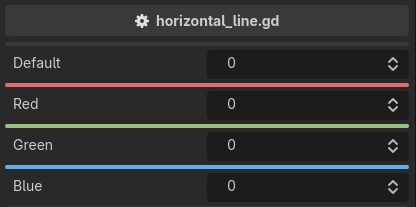

.. _label-horizontal-line:

horizontal_line
===============
Draws a horizontal line above the property, to separate it from what comes before.

It takes an optional hex color, with or without alpha. The default follows the editor theme --
it is the color of Godot's own category bars, so it tracks the theme you are using::

    extends Node3D

    @export_custom(PROPERTY_HINT_NONE, "horizontal_line")
    var default: int = 0

    @export_custom(PROPERTY_HINT_NONE, "horizontal_line:#e06c75")
    var red: int = 0

    @export_custom(PROPERTY_HINT_NONE, "horizontal_line:#98c379")
    var green: int = 0

    @export_custom(PROPERTY_HINT_NONE, "horizontal_line:#61afef")
    var blue: int = 0

.. note::
    The color is a literal, not an expression. Decorations are built once, when the inspector is built,
    so a color read from a property would be stale forever.
