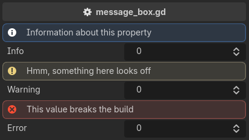

.. _label-message-box:

info_box / warning_box / error_box
==================================
Used for providing additional information::

    extends Node3D

    @export_custom(PROPERTY_HINT_NONE, "info_box:Information about this property")
    var info: int = 0

    @export_custom(PROPERTY_HINT_NONE, "warning_box:Hmm, something here looks off")
    var warning: int = 0

    @export_custom(PROPERTY_HINT_NONE, "error_box:This value breaks the build")
    var error: int = 0

.. note::
    The message takes the rest of the entry whole, so prose commas need no escaping.
    Only a ``;`` has to be written as ``\;``.

The message is a literal, and the box is drawn whatever the property holds.
For a message that appears only when something is wrong with the value, use :ref:`label-require`.
