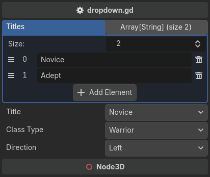

.. _label-dropdown:

dropdown
========
Provides an interface for dropdown value selection.

The option list is an expression, so it can name a property, a dictionary literal, or a method call --
and it re-evaluates, so a list that reads another property follows it::

    @tool # required for method calls in attributes
    extends Node3D

    const LEFT: Vector2 = Vector2(-1.0, 0.0)
    const RIGHT: Vector2 = Vector2(1.0, 0.0)
    const UP: Vector2 = Vector2(0.0, -1.0)
    const DOWN: Vector2 = Vector2(0.0, 1.0)

    @export
    var titles: Array[String] = ["Novice", "Adept"]

    @export_custom(PROPERTY_HINT_NONE, "dropdown:titles")
    var title: String = "Novice"

    @export_custom(PROPERTY_HINT_NONE, "dropdown:{'Warrior': 0, 'Archer': 1, 'Cleric': 2}")
    var class_type: int = 0

    @export_custom(PROPERTY_HINT_NONE, "dropdown:get_directions()")
    var direction: Vector2 = LEFT

    func get_directions():
        return {
            "Left": LEFT,
            "Right": RIGHT,
            "Up": UP,
            "Down": DOWN,
        }

An ``Array`` uses each element as both the label and the value.
A ``Dictionary`` uses the key as the label and the value as the value,
which is what lets the options carry a type the label could not spell, such as a ``Vector2``.

.. note::
    Every option must be assignable to the property: the same type, ``int`` ↔ ``float``,
    ``String`` ↔ ``StringName``, or ``null`` for an object property.
    One option that is not rejects the whole list by name, and the property falls back to a widget that works.

.. note::
    A stored value that matches none of the options is shown as ``{value} (not an option)``
    until you pick a real one. The widget never writes on your behalf -- correcting a value is
    a validator's job, not a drawer's.

This cannot be done with the built-in ``enum`` hint, whose list is baked into the property at build time.
