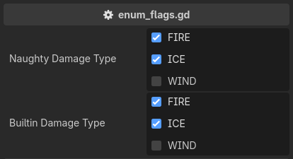

.. _label-enum-flags:

enum_flags
==========
Provides a checkbox interface for setting enum flags on an ``int`` property.

Unlike the built-in ``@export_flags``, which takes string literals, it takes the enum itself,
so the names and the values follow the declaration and a rename cannot leave it stale::

    extends Node3D

    enum DamageType { FIRE = 1, ICE = 2, WIND = 4 }

    # Takes the enum itself, so the names and values follow the declaration.
    @export_custom(PROPERTY_HINT_NONE, "enum_flags:DamageType")
    var naughty_damage_type: int = DamageType.FIRE | DamageType.ICE

    # The built-in annotation accepts only string literals, which a rename leaves stale.
    @export_flags("FIRE:1", "ICE:2", "WIND:4")
    var builtin_damage_type: int = DamageType.FIRE | DamageType.ICE

The widget is Godot's own flags editor, handed the names and values read from the enum,
so it behaves exactly like ``@export_flags`` in every other respect.
The checkbox text is the enum name verbatim, and a member without an explicit value gets ``1 << index``.

.. note::
    The enum is not sanity-checked beyond what only this attribute can know -- a declared name,
    an ``int`` property, and int values. A ``NONE = 0`` member is an inert always-checked box
    and a combined ``ALL = 7`` member is a set-all box, the same as with the built-in.
