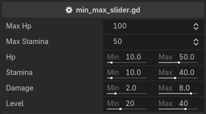

.. _label-min-max-slider:

min_max_slider
==============
A double slider. The **min value** is saved to the **x** component and the **max value** to the **y** component
of a ``Vector2`` or ``Vector2i`` property.

Both bounds are expressions, so a bound can be a literal, another property, or a method call,
and the slider follows it when it changes::

    @tool # required for method calls in attributes
    extends Node3D

    @export
    var max_hp: int = 100
    @export
    var max_stamina: int = 50

    @export_custom(PROPERTY_HINT_NONE, "min_max_slider:0,max_hp")
    var hp: Vector2 = Vector2(10, 50)
    @export_custom(PROPERTY_HINT_NONE, "min_max_slider:0,get_max_stamina(50)")
    var stamina: Vector2 = Vector2(10, 40)
    @export_custom(PROPERTY_HINT_NONE, "min_max_slider:0,10")
    var damage: Vector2 = Vector2(2, 8)
    @export_custom(PROPERTY_HINT_NONE, "min_max_slider:1,60")
    var level: Vector2i = Vector2i(20, 40)

    func get_max_stamina(bonus_stamina: int):
        return self.max_stamina + bonus_stamina

.. note::
    The attribute takes both bounds, in that order: ``min_max_slider:{min},{max}``.
    Applied to anything other than a ``Vector2`` or a ``Vector2i``, it reports an error
    and the property falls back to its default widget.
