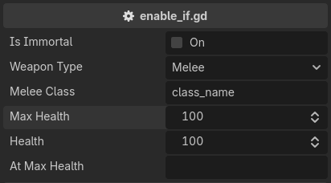

.. _label-enable-disable-if:

enable_if / disable_if
======================
Greys the property out and refuses input, based on some condition.
The condition is written exactly as for :ref:`label-show-hide-if`::

    @tool # required for method calls in attributes
    extends Node3D

    enum WeaponType { MELEE, RANGED, MAGIC }

    @export
    var is_immortal: bool = false

    @export
    var weapon_type: WeaponType = WeaponType.MELEE

    @export_custom(PROPERTY_HINT_NONE, "enable_if:weapon_type == WeaponType.MELEE")
    var melee_class: String = "class_name"

    @export_custom(PROPERTY_HINT_NONE, "enable_if:!is_immortal")
    var max_health: int = 100

    @export_custom(PROPERTY_HINT_NONE, "disable_if:!is_at_max_health()")
    var at_max_health: String = ""

    func is_at_max_health():
        return self.health >= self.max_health

``disable_if`` is ``enable_if`` with the condition negated. The two are the same attribute written from either side.

You can have more than one condition. They are ANDed, and ``&&``, ``||``, ``!`` and parentheses
are available inside a single condition as well::

    @export_custom(PROPERTY_HINT_NONE, "enable_if:flag_0; enable_if:flag_1")
    var enable_if_all: int = 0

    @export_custom(PROPERTY_HINT_NONE, "enable_if:flag_0 || flag_1")
    var enable_if_any: int = 0

.. note::
    Read-only is a drawing state, not a storage state. Decorators stay lit above a disabled property,
    and validators keep running on it, so a clamp still applies to a value another property changed.

To make a property read only unconditionally, use :ref:`label-read-only`.
