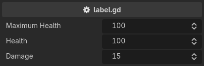

.. _label-label:

label
=====
Override the default property label::

    extends Node3D

    @export_custom(PROPERTY_HINT_NONE, "label:Maximum Health")
    var max_hp: int = 100

    @export_custom(PROPERTY_HINT_NONE, "label:Health")
    var hp: int = 100

    @export_custom(PROPERTY_HINT_NONE, "label:Damage")
    var dmg: int = 15

The text takes the rest of the entry whole, so a comma in it needs no escaping. Only a ``;`` has to be written as ``\;``.

.. note::
    The label replaces the one Godot computed, which means it also gives up what Godot did to it:
    the ``@export_group`` prefix stripping and the **Property Name Style** editor setting no longer apply.
