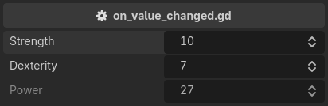
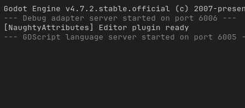

.. _label-on-value-changed:

on_value_changed
================
Detects a value change and executes a callback. The callback takes the old and the new value::

    @tool # required for method calls in attributes
    extends Node3D

    @export_custom(PROPERTY_HINT_NONE, "on_value_changed:print_value_change")
    var strength: int = 10

    @export_custom(PROPERTY_HINT_NONE, "on_value_changed:print_value_change")
    var dexterity: int = 7

    @export_custom(PROPERTY_HINT_NONE, "read_only")
    var power: int:
        get:
            return strength * 2 + dexterity

    func print_value_change(old_value, new_value):
        print(old_value, " -> ", new_value)

The argument is a method name, without parentheses. Exactly one signature is accepted,
``(old_value, new_value)``, and a property can carry more than one callback -- they are called in written order.

.. note::
    The callback is a method call, so the script needs ``@tool``. See :ref:`label-writing-attributes`.

.. note::
    Keep in mind that the event fires only when the value is changed **from the inspector**.
    Undo and redo restore values silently, and so does a clamp applied when the inspector is first built.

.. note::
    Callbacks run after Godot has committed its own undo action, so they see the new value,
    and a property a callback writes lands on screen at once.
