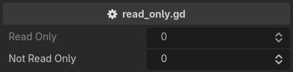

.. _label-read-only:

read_only
=========
Make a property read only::

    extends Node3D

    @export_custom(PROPERTY_HINT_NONE, "read_only")
    var read_only: int = 0

    @export
    var not_read_only: int = 0

It is :ref:`label-enable-disable-if` with no condition to evaluate, and takes no arguments --
anything written after the key is ignored.

.. note::
    A read-only property is greyed out and refuses input in the inspector.
    Nothing stops the value from being written from code, and validators still run on it.
