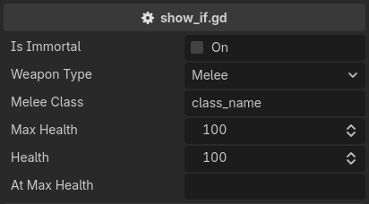

.. _label-show-hide-if:

show_if / hide_if
=================
Shows or hides the property, along with any decorators above it, based on some condition.

The condition is an expression evaluated against the edited object, so it can read a property,
compare an enum value, or call a method::

    @tool # required for method calls in attributes
    extends Node3D

    enum WeaponType { MELEE, RANGED, MAGIC }

    @export
    var is_immortal: bool = false

    @export
    var weapon_type: WeaponType = WeaponType.MELEE

    @export_custom(PROPERTY_HINT_NONE, "show_if:weapon_type == WeaponType.MELEE")
    var melee_class: String = "class_name"

    @export_custom(PROPERTY_HINT_NONE, "show_if:!is_immortal")
    var health: int = 100

    @export_custom(PROPERTY_HINT_NONE, "hide_if:!is_at_max_health()")
    var at_max_health: String = ""

    func is_at_max_health():
        return self.health >= self.max_health

``hide_if`` is ``show_if`` with the condition negated. The two are the same attribute written from either side.

You can have more than one condition. They are ANDed, and ``&&``, ``||``, ``!`` and parentheses
are available inside a single condition as well::

    @export_custom(PROPERTY_HINT_NONE, "show_if:flag_0; show_if:flag_1")
    var show_if_all: int = 0

    @export_custom(PROPERTY_HINT_NONE, "show_if:flag_0 || flag_1")
    var show_if_any: int = 0

.. note::
    A condition that fails to evaluate counts as satisfied, so a property never disappears because of a typo.
    The failure is reported instead. See :ref:`label-diagnostics`.

.. note::
    Validators do not run on a hidden property, and its message bubble hides with it.
