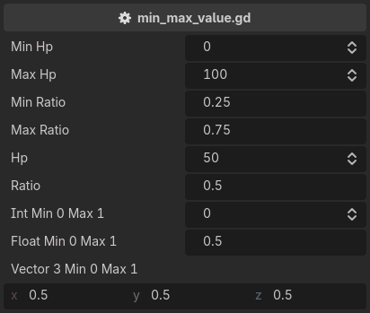

.. _label-min-max-value:

min_value / max_value
=====================
Can be used to limit the range of a property.
Can be applied to ``int``, ``float``, ``Vector2``, ``Vector3``, ``Vector4``, ``Vector2i``, ``Vector3i`` and ``Vector4i``.
A vector is clamped component-wise.

Both bounds are expressions, so a bound accepts a literal, another property, or a method call,
and a bounded property re-clamps when its bound changes::

    @tool # required for method calls in attributes
    extends Node3D

    @export
    var min_hp: int = 0
    @export
    var max_hp: int = 100
    @export
    var min_ratio: float = 0.25
    @export
    var max_ratio: float = 0.75

    @export_custom(PROPERTY_HINT_NONE, "min_value:min_hp; max_value:max_hp")
    var hp: int = 50
    @export_custom(PROPERTY_HINT_NONE, "min_value:get_min_ratio(); max_value:get_max_ratio()")
    var ratio: float = 0.5
    @export_custom(PROPERTY_HINT_NONE, "min_value:0; max_value:1")
    var int_min_0_max_1: int = 0
    @export_custom(PROPERTY_HINT_NONE, "min_value:0; max_value:1")
    var vector3_min_0_max_1: Vector3 = Vector3.ONE * 0.5

    func get_min_ratio() -> float:
        return self.min_ratio

    func get_max_ratio() -> float:
        return self.max_ratio

The two are one attribute mirrored, and either can be used on its own.

.. note::
    A correction is written into the value, so it enters the undo history.
    A drag leaves one undo entry, and undoing it restores what a property held before the drag started,
    not the value it was clamped to mid-drag.

.. note::
    A contradictory pair such as ``min_value:10; max_value:5`` is not reported.
    Validators run in written order, so the last one wins, visibly.

For a bound that reports rather than corrects, use :ref:`label-require`.
