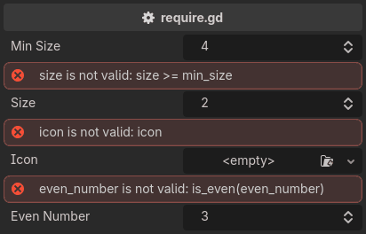

.. _label-require:

require
=======
The most powerful validator. It takes a boolean expression and draws a message beside the property
when the expression is false::

    @tool # required for method calls in attributes
    extends Node3D

    @export
    var min_size: int = 4

    @export_custom(PROPERTY_HINT_NONE, "require:size >= min_size")
    var size: int = 2

    @export_custom(PROPERTY_HINT_NONE, "resource_type:Texture2D; require:icon")
    var icon: Texture2D

    @export_custom(PROPERTY_HINT_NONE, "require:is_even(even_number)")
    var even_number: int = 3

    func is_even(number: int):
        return number % 2 == 0

``require:icon`` is a null check through Godot truthiness, ``require:hp > 0`` a bound,
and ``require:is_even(size)`` a call with the argument written out.
It replaces both of Unity's ``Required`` and ``ValidateInput`` attributes,
which are two attributes only because a C# attribute cannot carry an expression.

The message is built from the expression, so there is nothing to write::

    size is not valid: size >= min_size

.. note::
    ``require`` corrects nothing and writes nothing, so it is the one validator that never enters the undo history.

.. note::
    A property that already carries a built-in hint cannot carry attributes,
    which is why the ``icon`` above re-encodes its picker as ``resource_type:Texture2D``.
    See :ref:`label-writing-attributes`.
